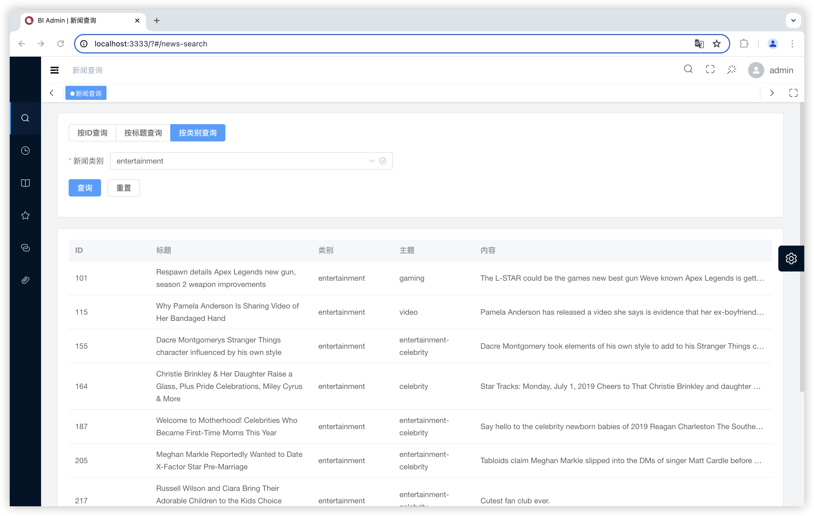

## ⚡ Introduction

Based on [Vue3](https://vuejs.org/), [Element Plus](https://element-plus.org/), [Apache Echarts](https://echarts.apache.org/) and [V3 Admin Vite](https://github.com/un-pany/v3-admin-vite)

Views:
### 1 新闻查询
按ID查询

按标题查询

按类别查询

分页查询

点击查看详情

### 2 新闻生命周期

### 3 新闻种类日流量变化

### 4 用户兴趣偏好变化

保留上一次查询的结果，方便对比不同用户的兴趣区别/同一用户的兴趣变化

### 5 多条件组合查询

提供选项包括：新闻类别、标题长度范围、浏览用户及时间

### 6 新闻推荐

### 7 其他

对所有页面做了缓存，回到之前页面时保留当时的搜索条件和结果